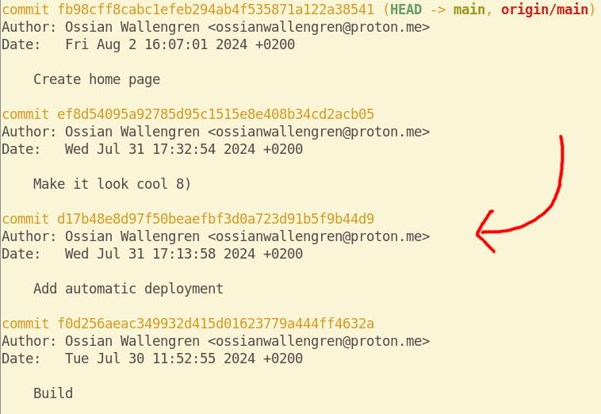
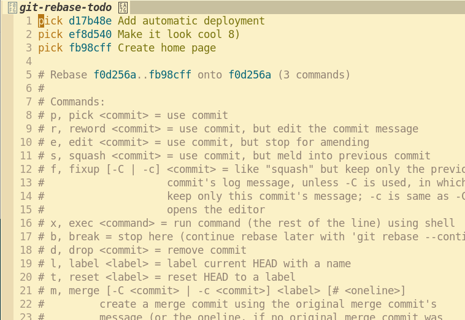
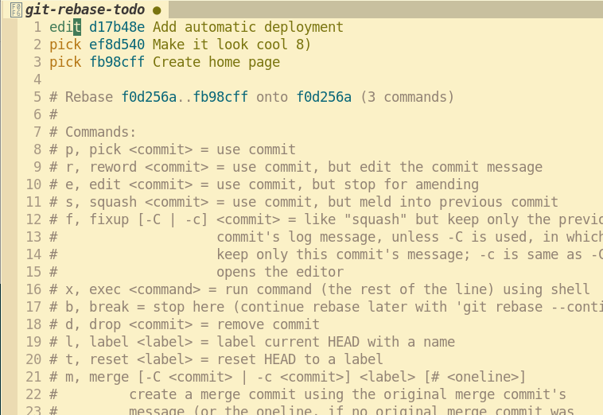
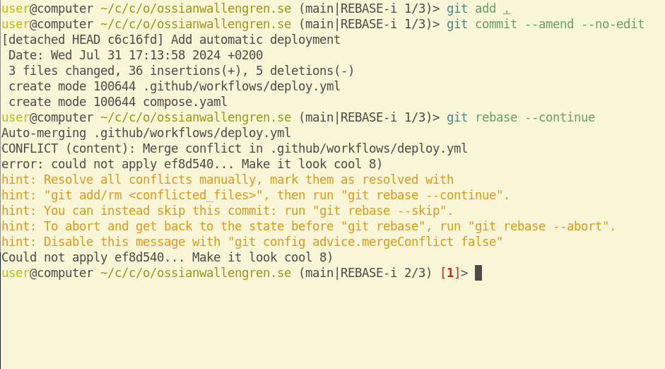
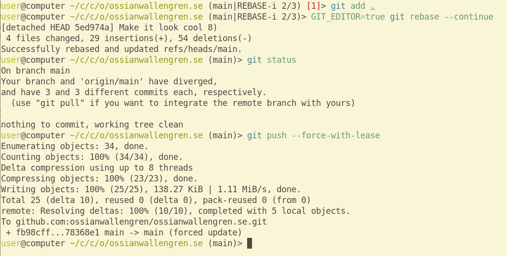

Har du råkat committa en hemlighet till ett repository på GitHub? Då är den här
guiden för just dig!

I det här demonstrativa exemplet, som är baserad på en verklig historia, har en
hemlighet av misstag committats i det tredje senaste committet.



Starta först en `rebase` på committet i fråga. Om det är det tredje senaste
commitet som gäller kan det specificeras med `HEAD~3`.

```sh
git rebase HEAD~3
```

Då öppnas följande vy in din textredigerare (om du satt dess kommando i
`$EDITOR` eller `$VISUAL`).



Ändra första ordet från `pick` till `edit` på committet du vill ändra på, som
bör stå längst upp spara sedan och stäng filen.



Nu kommer alla filer se ut som precis efter du skapade committet i fråga. Ta
bort hemligheten. I mitt fall bytte jag ut den mot att använda en _GitHub action
secret_. När det är klart, kör följande kommandon:

```sh
git add .
GIT_EDITOR=true git commit --amend --no-edit
git rebase --continue
```



Om du har gjort ändringar på samma ställe i ett senare commit kan du nu få
konflikter som måste lösas. Om inte kan du hoppa över nästa steg.

I det här fallet hade jag i committet efter formaterat om samma fil.
Repositoryt kommer nu se ut som efter committet där konflikten skedde, men med
båda två varianter av delen med konflikter: så det såg ut efter det senare
commitet och hur du ändrade det till tidigare i den här processen. Slå samman
dessa två varianterna. Till exempel applicerade jag samma formatering på den
nya varianten av filen utan hemligheten. När du är klar, kör följande kommandon:

```sh
git add .
GIT_EDITOR=true git rebase --continue
```

Detta kan du behöva upprepa fler gånger om fler commits ändrade samma del.

När inga fler konflikter finns som måste lösas bör `git` skriva ut något i stil
med `Successfully rebased and updated refs/head/main.`

Då är det bara ett steg kvar: att pusha upp ändringarna till GitHub. Eftersom
du nu måste överskrida commits som finns på GitHub, men som du inte vill ha
kvar, måste flaggan `--force` eller `--force-with-lease` användas om du endast
jobbat på repositoryt från en dator bör dessa flaggor göra samma sak.

```sh
git push --force-with-lease
```


